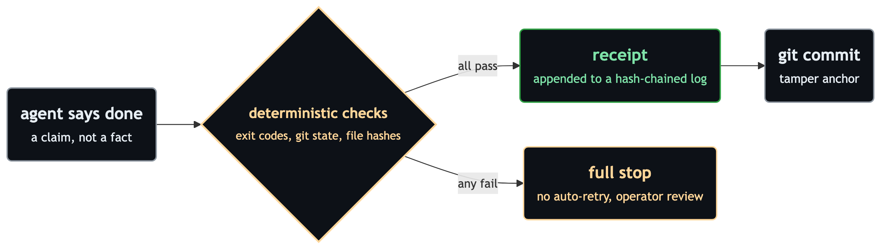
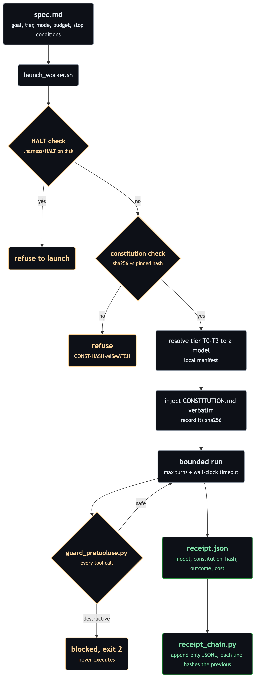
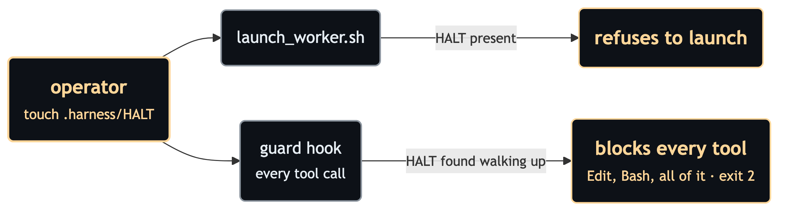

# harness-pack

[](https://github.com/pietro-falco/harness-pack/actions/workflows/ci.yml)
[](LICENSE)

> Pinned rules, a fail-closed guard, hash-chained receipts, and an
> operator kill-switch: the governance layer around every agent run.

**An agent's "done" is a claim, not a fact.** harness-pack turns that
claim into a deterministic, tamper-evident receipt: which rules were in
force (by hash), which model actually ran (by manifest), what the run
cost, and how it ended. It does this with zero runtime dependencies
beyond the Python 3 standard library and bash, so the entire enforcement
layer is small enough to audit in an afternoon. And it holds itself to
its own standard: every functional claim in this README points at a
fixture in the test suite, not at prose. See
[Every claim has a fixture](#every-claim-has-a-fixture).

<p align="center"></p>

<sub>Color key: amber marks a gate or anything waiting on the operator, green marks a verified pass, grey is neutral state.</sub>

## Why

Coding agents are genuinely capable and genuinely overconfident, and "I
finished the task" is the cheapest sentence they can produce.
Orchestrators multiply that output. They do not verify it, and they do
not constrain what a worker may do while producing it. harness-pack
supplies the missing envelope: rules the worker provably received,
commands it provably could not run, and evidence that provably was not
rewritten afterwards. There are no judgment calls and no "the model said
it went fine". A check either passes with evidence or the whole run
stops.

## Architecture

`launch_worker.sh` is the single entry point, and everything else hangs
off that spine. It refuses to start if the kill-switch is engaged or if
the constitution on disk does not match the pinned hash. It resolves an
abstract tier to a concrete model through your private manifest. It
bounds the run, and the guard hook screens every tool call while the run
is in flight. At the end, the receipt lands in the hash-chained log.

<p align="center"></p>

## The HALT kill-switch

`touch .harness/HALT` stops everything, twice over: the launcher refuses
to start new runs, and the guard hook, which fires on every tool call
and not just Bash, neutralizes runs already in flight. The HALT search
walks *up* the directory tree from both the tool's working directory and
`CLAUDE_PROJECT_DIR`, so a worker cannot dodge it by `cd`-ing into a
subdirectory. Deleting the file lifts the halt. No restart, no state
cleanup, no ceremony.

<p align="center"></p>

## What's in the box

| File | What it does |
|---|---|
| [`CONSTITUTION.md`](CONSTITUTION.md) | Behavioral rules injected verbatim into every worker prompt; its sha256 lands in every receipt, so "the rules were in force" is provable, and the launcher refuses to run if the file drifts from the pinned hash |
| [`scripts/guard_pretooluse.py`](scripts/guard_pretooluse.py) | Fail-closed PreToolUse hook: blocks destructive shell commands *before* they execute and enforces HALT across all tools; false positives are accepted by design |
| [`scripts/launch_worker.sh`](scripts/launch_worker.sh) | The launcher: kill-switch check, constitution pinning, tier to model resolution, bounded run, receipt |
| [`scripts/receipt_chain.py`](scripts/receipt_chain.py) | Append-only JSONL log where every line hashes the previous one; edits and missing interior lines are detectable, see [`examples/receipt-chain.sample.jsonl`](examples/receipt-chain.sample.jsonl) |
| [`templates/manifest.example.json`](templates/manifest.example.json) | Maps abstract tiers T0-T3 to real model names; your copy stays local (`*.local.json` is gitignored), so model churn is a one-line config edit |
| [`specs/recurring/RS-001-receipt-rollup.md`](specs/recurring/RS-001-receipt-rollup.md) | The canonical recurring job: file loose receipts into the chained log, archive originals via `git mv` (never `rm`) |
| [`scripts/harness_stats.py`](scripts/harness_stats.py) | Reads receipts, emits `stats.md` + `dashboard.html` on demand; flags failed runs and budget-burners. A generated file, not a server |
| [`scripts/lint_specs.py`](scripts/lint_specs.py) | Rejects any spec that claims unattended autonomy (mode B) without fully deterministic checks |
| [`tests/`](tests/) + [CI](.github/workflows/ci.yml) | The guard, the chain, the launcher gates and the lint are themselves tested on every push |

## Quickstart

```bash
# 1. Prove the machinery works on your machine
bash tests/run_tests.sh        # expect: ALL TESTS PASSED

# 2. Create your private model manifest (never committed: *.local.json
#    is gitignored) and point the launcher at it
cp templates/manifest.example.json ~/path/to/model-manifest.local.json
#    then edit the "chain" arrays with real model names
export HARNESS_MANIFEST="$HOME/path/to/model-manifest.local.json"

# 3. Write a spec from the template, then launch a bounded run
cp templates/spec.template.md my-first-spec.md
scripts/launch_worker.sh my-first-spec.md

# Emergency stop for all current and future runs:
touch .harness/HALT
```

## Every claim has a fixture

The thesis applies to this README too: a description of behavior is a
claim until a test pins it. Each row below names the fixture in
[`tests/run_tests.sh`](tests/run_tests.sh) (by its literal `==` section
header) that fails CI if the claim stops being true.

| Claim | Fixture |
|---|---|
| The guard blocks `rm -rf`, force-push (including `--force-with-lease` and `+ref`), `--no-verify`, `git add -A`, `reset --hard`, `clean -fd`, `filter-branch` and nested `bash -c "rm …"`, and accepts false positives as the price of fail-closed | `== guard fixtures ==` over the 20 cases in [`tests/guard_cases.jsonl`](tests/guard_cases.jsonl) |
| Tier indirection is single-hop: a manifest where T0 resolves to T3 is refused at launch | `== single-hop tier resolution fixture (D8b) ==` |
| A constitution that doesn't match the manifest's pinned sha256 refuses to launch (`CONST-HASH-MISMATCH`) | `== constitution hash pinning fixture ==` |
| HALT in the *target* repo refuses launch even when `RECEIPTS_DIR` points elsewhere | `== HALT kill-switch in target repo refuses launch ==` |
| HALT neutralizes a run in flight: Edit, benign Bash, from a deep subdirectory, and via `CLAUDE_PROJECT_DIR` when the payload cwd is clean; lifting it restores normal operation | `== HALT kill-switch neutralises a run in flight (guard, all tools) ==` |
| The chain detects mutation of an interior line and removal of the first line | `== receipt_chain selftest ==` (`receipt_chain.py selftest`) |
| A mode-B spec whose checks are not fully deterministic is rejected | `== spec lint ==` (`lint_specs.py`) |

## Vocabulary

- **verify: gate | review.** Each acceptance criterion declares its
  verification path: `gate` (deterministic) or `review` (human
  judgment). Mode B (unattended) is legal only when *every* criterion is
  `gate` and nothing destructive is in scope. A single `review`
  criterion forces a human in the loop, with no discounts.
- **Tiers T0-T3.** Semantic capability levels (judgment-authoring,
  trust-anchor, execution, subagent). Model names never appear in pack
  specs or pack governance (lint-enforced); only your local manifest
  knows them.
- **receipt-chain.jsonl.** The append-only hash-chained evidence log.
  Not a harnesswright slice ledger; the different name is on purpose.

## Guarantees and honest limits

- The chain detects mutation, insertion, reordering and removal of
  interior lines. From the file alone it cannot detect mutation of the
  *final* line or a clean tail truncation; the atomic git commit anchors
  exactly those. Authoritative verification reads the committed blob
  (`git show HEAD:<chain>`).
- The guard is fail-closed regex, not a proof: gaps become test
  fixtures, fixtures become releases. It is one of two independent
  layers; the declarative deny rules in
  [`templates/settings.mode-b.json`](templates/settings.mode-b.json)
  are the other.
- On an auth mode without standing API keys, per-run cost fields may be
  null; `num_turns` is the primary budget signal.
- The full risk register, including the threat-model notes on prompt
  injection and secrets in receipts, lives in
  [`docs/RISKS.md`](docs/RISKS.md).

## Non-goals

No LLM-as-judge gates. No auto-retry of failed gates. No always-on
services: the dashboard is a generated file, not a server.

## Where it sits

- [**harnesswright**](https://github.com/pietro-falco/harnesswright)
  keeps the evidence-gated slice ledger: *what* work exists and whether
  it may proceed.
- [**verity**](https://github.com/pietro-falco/verity) answers the
  narrow question underneath: *is this specific assertion true against
  reality?*
- **harness-pack** (this repo) wraps the run itself: the rules, the
  routing, and the receipts.

## Governance

This project's own ADRs live in `docs/adrs/` (ADR-001+). Broader
governance decisions affecting deployment topology, guard
tamper-resistance, and repo conventions are recorded in a private,
operator-side ADR series and are out of scope for this public repo. The
public invariants those decisions enforce, and that this pack is built
to guarantee, are:

- **Enforced-copy deploy topology**: the runtime pack a worker executes
  against is a separate, non-writable copy outside the worker's own
  tree; editing the dev source never changes what the enforcer runs.
- **Tamper gate on the deployed copy**: the deployed pack's integrity is
  verified against a pinned hash before every run; drift is a stop
  condition.
- **Constitution hash pinned into every receipt**: the governance rules
  injected into a run are hash-pinned, so every receipt is traceable to
  the exact constitution version that governed it.

## Requirements

Python 3 and bash. No packages to install, no daemon, no network calls,
nothing listening on a port. CI runs on Python 3.12.

## License

Apache-2.0, see [`LICENSE`](LICENSE).
