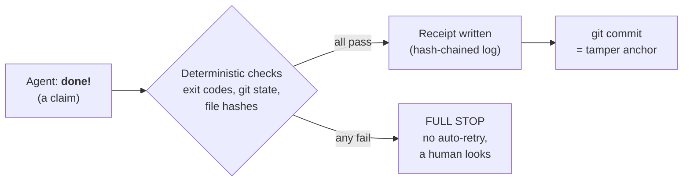
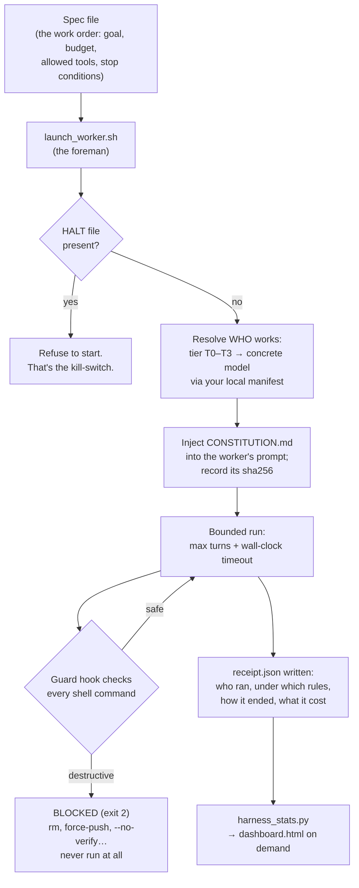

# harness-pack

Rules, receipts, and a kill-switch for autonomous AI agents.
Zero runtime dependencies beyond Python 3 stdlib and bash.

**Thesis: an agent's "done" is a claim, not a fact.** Everything in
this repo exists to turn claims into deterministic, tamper-evident
receipts.

## The problem, in plain words

Imagine hiring a contractor who works while you sleep. In the morning
you get a text: "all done!" Do you transfer the money?

Of course not. You want three things: **house rules** posted where
the crew can't miss them, an **inspection** that doesn't depend on
the contractor's word, and **signed paperwork** that can't be
quietly rewritten afterwards.

AI agents are that contractor. They are genuinely capable and
genuinely overconfident, and "I finished the task" is the cheapest
sentence they can produce. harness-pack is the rules, the
inspection, and the paperwork.

## How it works — the 60-second version



No judgment calls, no "the model said it went fine." A check either
passes with evidence or the whole run stops.

## A supervised night run, step by step



## What's in the box

| File | On a construction site | What it actually does |
|---|---|---|
| `CONSTITUTION.md` | House rules at the gate | Injected verbatim into every worker prompt; its sha256 lands in every receipt, so "the rules were in force" is provable |
| `scripts/guard_pretooluse.py` | Circuit breaker | Blocks destructive shell commands *before* they execute; fail-closed, so false alarms are accepted by design |
| `scripts/launch_worker.sh` | The foreman | Kill-switch check, picks the model from your manifest, injects the rules, bounds the run, writes the receipt |
| `scripts/receipt_chain.py` | Logbook with numbered carbon pages | Append-only JSONL where every line hashes the previous one; edits and missing pages are detectable |
| `templates/manifest.example.json` | Staff roster | Maps abstract tiers T0–T3 to real model names; edit your local copy freely, no governance ceremony |
| `specs/recurring/RS-001-receipt-rollup.md` | A standing work order | The canonical recurring job: file loose receipts into the chained logbook, archive originals via `git mv` (never `rm`) |
| `scripts/harness_stats.py` | The weekly site report | Reads receipts, emits `stats.md` + `dashboard.html`; flags failed runs and budget-burners |
| `scripts/lint_specs.py` | Permit office | Rejects any spec that claims autonomy (mode B) without fully deterministic checks |
| `tests/` + CI | Building inspector for the inspectors | The guard, the chain, and the lint are themselves tested on every push |

## Quickstart

```bash
# 1. Prove the machinery works on your machine
bash tests/run_tests.sh        # expect: ALL TESTS PASSED

# 2. Create your private model manifest (never committed: *.local.json
#    is gitignored) and point the launcher at it
cp templates/manifest.example.json ~/path/to/model-manifest.local.json
#    …edit the "chain" arrays with real model names…
export HARNESS_MANIFEST="$HOME/path/to/model-manifest.local.json"

# 3. Write a spec from the template, then launch a bounded run
cp templates/spec.template.md my-first-spec.md
scripts/launch_worker.sh my-first-spec.md

# Emergency stop for all future runs:
touch .harness/HALT
```

## Vocabulary (aligned with the A1/D8b proposal set; harnesswright port pending)

- **verify: gate | review** — each acceptance criterion declares its
  verification path: `gate` (deterministic) or `review` (human
  judgment). Mode B (unattended) is legal only when *every* criterion
  is `gate` and nothing destructive is in scope. One `review`
  criterion forces a human in the loop — no discounts.
- **Tiers T0–T3** — semantic capability levels (judgment-authoring,
  trust-anchor, execution, subagent). Model names never appear in pack
  specs or pack governance (lint-enforced here; harnesswright's
  `model` field remains opaque by its own ADR-004/D8); only your local
  manifest knows them, so model churn is a one-line config edit.
- **receipt-chain.jsonl** — the append-only hash-chained evidence
  log. Not a harnesswright slice ledger; the different name is on
  purpose.

## Guarantees and honest limits

- The chain detects mutation, insertion, reordering and removal of
  interior lines. From the file alone it cannot detect mutation of
  the *final* line or clean tail truncation — that's what the atomic
  git commit anchors. Authoritative verification reads the committed
  blob (`git show HEAD:<chain>`).
- The guard is fail-closed regex, not a proof: gaps become test
  fixtures, fixtures become releases. It's one of two layers — the
  declarative deny rules in `templates/settings.mode-b.json` are the
  other, and they are independent.
- On subscription auth, per-run cost fields may be null; `num_turns`
  is the primary budget signal.

## Non-goals

No LLM-as-judge gates. No auto-retry of failed gates. No always-on
services — the dashboard is a generated file, not a server.

## Companions

- **harnesswright** — evidence-gated slice ledgers: *what* work
  exists and whether it may proceed.
- **verity** — deterministic claim verification: *is this specific
  assertion true against reality?*
- **harness-pack** (this repo) — the rules, routing, and receipts
  around every run.
