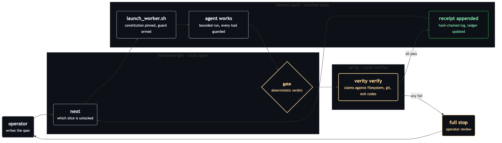

# The Stack

> Three repos, one thesis: an agent's "done" is a claim until a
> deterministic gate turns it into a receipt.

This document is the canonical account of how the stack fits together,
and the authoritative home of the [agent contract](#agent-contract)
every session operating these repos must follow. Each repo's
`CLAUDE.md` is a thin projection of this file: a pointer, not a copy.

## The three layers

The stack separates what should happen, what actually runs, and what
can be proven, and never blurs the three.

| Layer | Home | What lives there |
|---|---|---|
| **Intent** | specs + ADRs | What should exist and why. Architectural decisions land as ADRs (Proposed → Accepted, two commits); work is cut into slices with declared acceptance criteria. Intent is authored and reviewed, never improvised by the session executing it. |
| **Execution** | Claude Code, wrapped by **harness-pack** | The bounded run: a pinned constitution injected verbatim, a fail-closed guard screening every tool call, an operator kill-switch, abstract model tiers resolved through an untracked local manifest. The session does the work; it never grades the work. |
| **Truth** | **harnesswright** plan gate → **verity** → hash-pinned receipts | Whether work may proceed, and whether it actually happened. harnesswright's gate decides eligibility from the slice ledger; verity checks each declared claim against reality with a deterministic command; the outcome lands in a hash-chained receipt log anchored by a git commit. |

The separation is the point: Intent never executes, Execution never
judges itself, and Truth is computed from evidence rather than
asserted. A layer that borrows another layer's job is a bug.

## Composition

The dependency is one-directional. harness-pack is the composition
point: the only repo that sees all three vocabularies. Neither
harnesswright nor verity knows harness-pack exists, and verity depends
on nothing in the stack.

Color key: amber marks a gate or anything waiting on the operator, green marks a verified pass, grey is neutral state.

At runtime, the launcher consumes harnesswright's plan
(`harnesswright next --json`) to decide whether a slice may launch,
and verity's report (`verity verify --json`) to decide whether the
work passed. verity's independence is deliberate: it is the layer the
other two are judged by, so it must stay trustable on its own. Zero
dependencies, no network, no model calls.

CLI resolution follows house convention: an explicit environment
override (`HARNESSWRIGHT_CLI` / `VERITY_CLI`) wins; otherwise an
installed binary on `PATH`; otherwise the launcher stops with
actionable guidance. No machine-specific path is ever a tracked
default.

## Why receipts beat prose

"I finished the task" is the cheapest sentence an agent can produce.
The stack replaces it with three properties that don't depend on
trusting the narrator:

- **Verifiable execution.** Every run ends in a receipt recording the
  exact rules in force (by sha256), the model that actually ran
  (resolved from an abstract tier), the outcome, and the cost. Anyone
  can re-check it from the committed blob; the receipt survives the
  session that wrote it.
- **Deterministic gates.** A gate is a command with an expected exit
  code. No LLM-as-judge, no auto-retry, no "probably fine": a check
  passes with evidence or the run stops and a human looks.
- **Attested supply chain.** Rules are hash-pinned before the run,
  receipts are hash-chained after it, and a git commit anchors the
  tail of the chain. Mutation, reordering, and interior deletion are
  detectable; the commit anchors what the file alone cannot.

Prose scales with model fluency. Receipts scale with nothing: they
are either reproducible or they are not, and that asymmetry is the
whole moat.

## Licenses

The split is deliberate, not drift, and there is no plan to relicense:

- **harness-pack: Apache-2.0.** The enforcement layer: code that
  executes, gates, and blocks real work on real machines. Apache-2.0's
  explicit patent grant is the right fit for the layer users must be
  able to run in anger without a licensing question mark.
- **harnesswright and verity: MIT.** Thin, zero-dependency libraries
  whose value is maximal reuse and embedding. MIT's minimal footprint
  removes every barrier to pulling them into another stack.

## Agent contract

This section is the single authoritative statement of the execution
rules for any agent session working in any repo of this stack. The
per-repo `CLAUDE.md` files point here rather than restating it; a
fresh session needs nothing beyond this section to operate correctly.

### ADR gate

- Implement only against an ADR whose status line literally reads
  **Accepted**. Verify by reading the file, not from memory; recall
  is not evidence.
- Two-commit lifecycle: the ADR lands as **Proposed** in its own
  commit; a second commit flips it to **Accepted** after operator
  review; implementation commits come only after that flip.
- Accepted ADRs are immutable. Correct them by superseding with a new
  ADR or an appended amendment, never by editing in place.

### Evidence discipline

- Evidence is raw output: exit codes, literal stdout,
  `git show HEAD:<path>` blobs, commit hashes, receipts. A prose
  summary is never evidence of file content, commit state, or test
  results: neither accepted nor produced as such.
- Recon before write: read the literal current state before authoring,
  editing, or asserting a baseline.
- Verify after write: read every file back in the same step it was
  written. Post-commit, the source of truth is the committed blob,
  not the working tree.
- Never assert a status (accepted, done, closed, green) without a
  literal check of the source of truth.

### Git hygiene

- Stage explicit paths only: `git add -- <file>`. Never `git add -A`,
  `--all`, or a bare `git add .`.
- Never bypass hooks: no `--no-verify`. A hook blocking a commit is a
  stop condition: surface its output verbatim and stop.
- No destructive operations without an explicit operator directive:
  no `git reset --hard`, no force-push, no `git clean`, no history
  rewrite, no discarding uncommitted work.
- Commits are atomic: one logical change each, with a
  Conventional-Commit prefix.

### Scope and stops

- A directive is a ceiling, not a launch point: execute what it says
  and stop at every stated gate, even when the next step looks
  obviously correct.
- A failed gate is a full stop: no auto-retry, no repair beyond what
  the spec authorizes. Record the outcome and let the operator decide.
- Model identity is indirect by design: specs and governance name
  abstract tiers (T0–T3) or `*_CLASS_MODEL` placeholders; concrete
  model IDs live only in an untracked local manifest.
