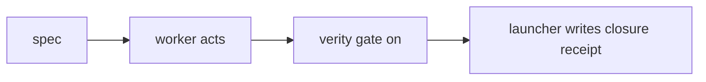

---
# Mode B spec template. Every field below is a harnesswright spec.js gate (ADR-006).
# Copy to .harness/specs/<ID>.md, fill values, register <ID> in .harness/harness.json.
type: chore            # REQUIRED (mode B): chore | bug | feature  (hotfix is Mode A only)
mode: B                # A | B
status: proposed       # proposed | accepted
effort: low            # low | high
tools: "Read,Bash,Grep,Glob"   # REQUIRED: non-empty; launcher STOPs if next emits empty spec.tools
budget:                # REQUIRED: a map with at least one of tokens / turns / wall_clock
  turns: 10
  wall_clock: "15m"    # must match ^\d+(m|h)$
stop_conditions:
  - budget-exhaustion
criteria:              # REQUIRED: non-empty list of claim IDs (the gate scope, ADR-004 D7)
  - <claim-id>
scope:                 # REQUIRED (mode B): non-empty; repo-relative prefixes, no leading / or ..
  - <path>
---

# <ID> — <title>

Purpose: one line on what mechanics this slice exercises.

## ADW

Task: <what the worker must do — create/edit which files, commit message>.
Then stop; the launcher runs the gate and writes the closure receipt.
Touch nothing outside the declared scope.

Acceptance: gate exit 0 on criteria [<claim-id>]; receipt present under
.harness/receipts/; commit content visible via git show HEAD:<file>.
